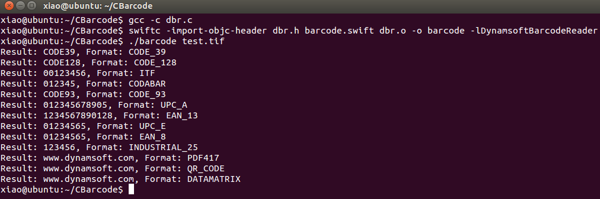

# Swift Barcode Reader for Linux
Build a command line barcode reader in Swift and C on Linux. 

## Environment
* Swift 4.0
* Ubuntu 14.04
* [Dynamsoft Barcode Reader SDK 5.2 for Linux](https://www.dynamsoft.com/Downloads/Dynamic-Barcode-Reader-for-Linux-Download.aspx). 

## How to Build and Run
1. Copy libDynamsoftBarcodeReaderx64.so to **/usr/lib/**:

    ```
    sudo cp <Your PATH>/libDynamsoftBarcodeReaderx64.so /usr/lib/libDynamsoftBarcodeReader.so
    ```

2. Compile C file with **gcc**:
    
    ```
    gcc -c dbr.c
    ```
3. Compile Swift file with **swiftc**:

    ```
    swiftc -import-objc-header dbr.h barcode.swift dbr.o -o barcode -lDynamsoftBarcodeReader

    ```

4. Run the test app:

    ```
    ./barcode test.tif
    ```
    

## Blog
[Building Swift Barcode Reader with DBR 5.2 for Linux](http://www.codepool.biz/linux-swift-barcode-reader.html)
